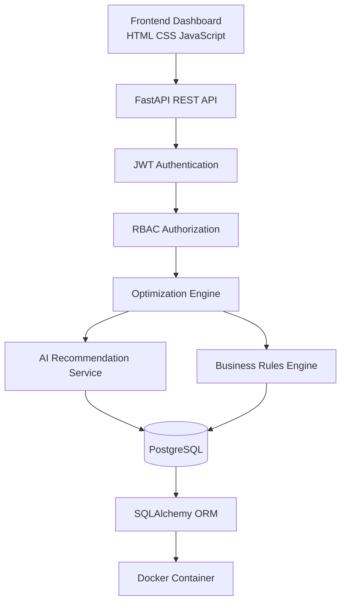

# 🚀 Enterprise AI Model Selection Optimizer

     

An enterprise-grade AI platform that intelligently recommends the best Large Language Model (LLM) for enterprise workloads using multiple optimization criteria including cost, latency, quality, privacy, deployment strategy, and business requirements.

---

## 🌟 Project Highlights

- Enterprise-grade AI Model Selection Platform
- FastAPI REST API Architecture
- PostgreSQL + SQLAlchemy ORM
- JWT Authentication & Role-Based Access Control (RBAC)
- Dockerized Development Environment
- AI Recommendation Engine
- Interactive Dashboard
- Swagger/OpenAPI Documentation
- Enterprise Project Structure

---

## Why This Project?

Selecting an enterprise AI model involves balancing:

- Cost
- Accuracy
- Latency
- Context Window
- Privacy
- Deployment Strategy

This platform evaluates these factors and recommends the most suitable model for enterprise workloads.

---

# Architecture

```
                +----------------------+
                |    Frontend UI       |
                | HTML/CSS/JavaScript  |
                +----------+-----------+
                           |
                           |
                    FastAPI REST APIs
                           |
        +------------------+------------------+
        |                                     |
 Authentication                    AI Optimization Engine
 JWT + RBAC                     Recommendation Service
        |                                     |
        +------------------+------------------+
                           |
                     PostgreSQL Database
                           |
                  Docker Containerized
```

## Enterprise Architecture Layers

```
Frontend Layer
      ↓
FastAPI REST API Layer
      ↓
Authentication Layer
      ↓
Business Logic Layer
      ↓
Recommendation Engine
      ↓
Database Layer
      ↓
PostgreSQL
```

## 🏗 Enterprise Architecture (Diagram)



---

# Tech Stack

## Backend

- Python
- FastAPI
- SQLAlchemy
- Pydantic

## Database

- PostgreSQL
- SQLAlchemy ORM

## Security

- JWT Authentication
- OAuth2
- RBAC

## DevOps

- Docker
- Docker Compose

## Testing

- Pytest

## Documentation

- Swagger
- OpenAPI

---

# Features

## Phase 1

- Enterprise AI Model Catalog
- FastAPI REST APIs
- AI Model Selection Logic
- Request Validation
- Business Rules Engine

---

## Phase 2

- Interactive Dashboard
- Optimization APIs
- HTML/CSS/JavaScript Frontend
- Charts & Visualizations
- Enterprise UI

---

## Phase 3

- PostgreSQL Integration
- SQLAlchemy ORM
- Docker Compose
- CRUD Operations
- Optimization History
- Persistent Storage

---

## Phase 4A

- JWT Authentication
- User Registration
- Secure Login
- OAuth2 Password Flow
- Role-Based Access Control
- Protected APIs
- Admin Authorization

---

## Phase 4B (In Progress)

- AI Recommendation Assistant
- Intelligent Model Ranking
- Natural Language Queries
- Enterprise Recommendation Engine

---

# 📸 Application Screenshots

## Swagger API Documentation


---

## Enterprise Dashboard


---

## JWT Authentication


---

## PostgreSQL Database


---

# 🔌 Sample API Responses

## Register

Request

```
POST /api/v1/auth/register
```

```json
{
  "username": "girish",
  "email": "girish@example.com",
  "password": "Password123"
}
```

Response

```json
{
  "id": "uuid",
  "username": "girish",
  "email": "girish@example.com",
  "role": "user"
}
```

## Login

```
POST /api/v1/auth/login
```

```json
{
  "access_token": "eyJhbGciOiJIUzI1NiIs...",
  "token_type": "bearer"
}
```

## Optimize

```
POST /optimize
```

```json
{
  "use_case": "RAG",
  "recommended_model": "GPT-4o",
  "provider": "OpenAI",
  "score": 95.6,
  "reason": "Best balance of cost, latency and quality."
}
```

## AI Recommendation

```
POST /api/v1/assistant/recommend
```

```json
{
  "question": "Recommend an inexpensive model for customer support",
  "recommendation": {
    "name": "GPT-4o-mini",
    "provider": "OpenAI",
    "score": 91.2
  },
  "answer": "GPT-4o-mini is recommended because..."
}
```

---

# REST APIs

## Authentication

```
POST /api/v1/auth/register
POST /api/v1/auth/login
GET  /api/v1/auth/me
GET  /api/v1/auth/admin-check
```

## Optimization

```
POST /optimize
GET  /models
GET  /history
```

## Assistant

```
POST /assistant/recommend
```

---

# 📅 Project Timeline

| Phase | Status | Description |
|--------|--------|-------------|
| Phase 1 | ✅ Completed | Enterprise AI Model Selection Engine |
| Phase 2 | ✅ Completed | Dashboard, APIs & Frontend |
| Phase 3 | ✅ Completed | PostgreSQL, SQLAlchemy & Docker |
| Phase 4A | ✅ Completed | JWT Authentication & RBAC |
| Phase 4B | 🚧 In Progress | AI Recommendation Assistant |
| Phase 4C | 🔜 Planned | RAG & Vector Database |
| Phase 4D | 🔜 Planned | Redis & Performance |
| Phase 4E | 🔜 Planned | CI/CD & Kubernetes |

---

# Project Structure

```text
app/
│
├── api/
├── auth/
├── core/
├── crud/
├── database/
├── schemas/
├── services/
├── static/
├── templates/
└── main.py

tests/

docker-compose.yml
requirements.txt
README.md
```

---

# Authentication

- JWT Authentication
- Protected APIs
- OAuth2 Password Flow
- Role-Based Authorization
- Admin/User Roles

---

# Database

- PostgreSQL
- SQLAlchemy ORM
- UUID Primary Keys
- Optimization History
- User Management
- AI Model Catalog

---

# API Documentation

```
http://localhost:8000/docs
```

Swagger UI

```
http://localhost:8000/redoc
```

ReDoc

---

# 🚀 Demo

## API Documentation

http://localhost:8000/docs

## ReDoc

http://localhost:8000/redoc

---

# Running the Project

```bash
git clone <repo>

cd enterprise-ai-model-selection-optimizer

docker-compose up -d

pip install -r requirements.txt

uvicorn app.main:app --reload
```

---

# 🗺 Roadmap

- [x] Phase 1
- [x] Phase 2
- [x] Phase 3
- [x] Phase 4A
- [ ] Phase 4B
- [ ] RAG
- [ ] LangChain
- [ ] LangGraph
- [ ] Redis
- [ ] Kubernetes
- [ ] CI/CD
- [ ] Monitoring
- [ ] Production Deployment

---

# 💡 Skills Demonstrated

- Python
- FastAPI
- PostgreSQL
- SQLAlchemy
- Docker
- JWT Authentication
- RBAC
- REST APIs
- Enterprise Backend Development
- AI Optimization
- Business Rule Engines
- Pydantic
- Swagger
- OpenAPI
- Testing with Pytest

---

# 👨‍💻 Author

**Girish Gopal Reddy Vuyyuru**

AI/ML Engineer | Generative AI Engineer | Python Backend Engineer

- GitHub: https://github.com/gireeshvuyyuru501-design
- LinkedIn: https://www.linkedin.com/in/girish-genai-engineer

---

# License

MIT License

---

⭐ If you found this project useful, please consider starring the repository.

Contributions, issues and feature requests are welcome.

Made with ❤️ by **Girish Gopal Reddy Vuyyuru**
